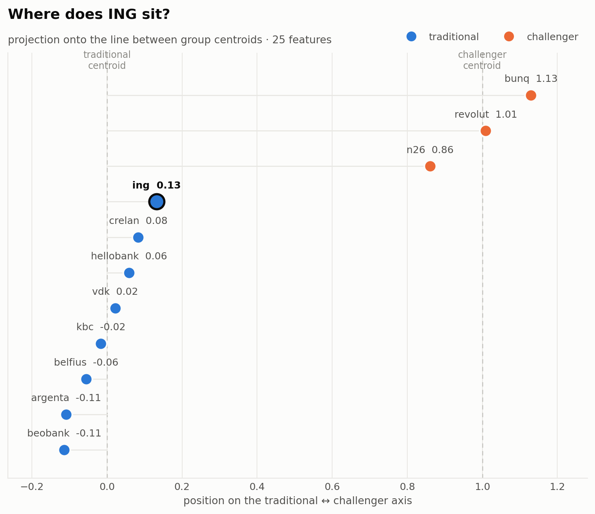
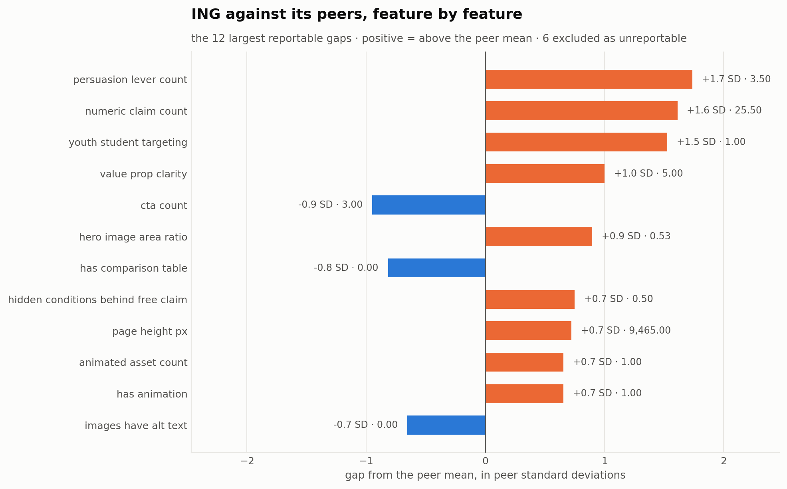
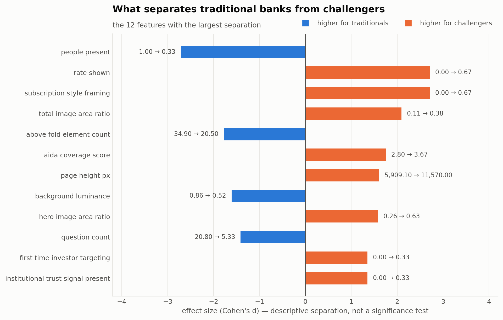
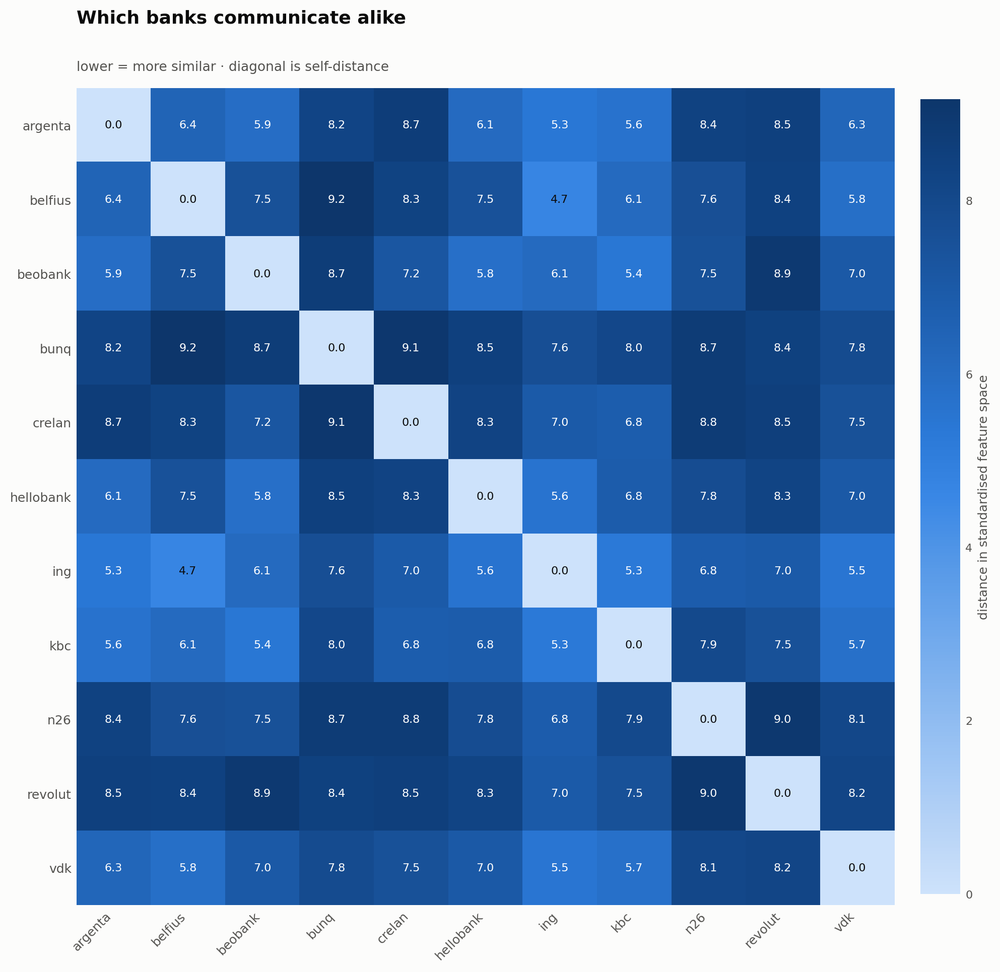

# What the charts measure

Companion to the figures in this folder. Each section says what the chart is actually computing, how to read it, what this particular run shows, and what it cannot support — in that order.

*Generated by `scripts/run_analysis.py` from `data/processed/campaigns_scored.csv` — 13 pages across 11 banks.*

---

## Why the charts use fewer features than the dictionary has

The dictionary defines 104 features. The comparisons here use **25**. Nothing is thrown away quietly — this is the whole reduction:

```
104 features in the dictionary
  - 18  provenance                 identify a page, do not describe a campaign
  -  4  free text / identifiers    no two pages share them
  -  8  within_language, mixed languages present not comparable across languages (comparability in the dictionary)
  - 27  categorical / list         not encoded - see note below
  - 16  missing for some bank      cannot compare what one bank lacks
  -  6  no variation across banks  identical everywhere, carries no signal
  = 25  features used in this comparison
```

**The line worth arguing about is the 27 categorical and list features.** They are not free text and not redundant — things like `benefit_framing`, `fab_level`, `layout_archetype`, `dominant_image_type`, `persuasion_levers`, and seven of the banking-domain dimensions. A euclidean distance cannot take a raw category, so they sit out of every distance and positioning calculation today.

They *can* be included (`include_categorical=True`), one-hot encoded with each feature's indicators scaled by 1/√k so a 5-value category does not silently outweigh five numbers. It is off by default because switching it on moves every number in the analysis, which is a team decision rather than a default.

The four bands (`word_count_band` and friends) are excluded on purpose: each is a coarser view of a number already in the matrix, so counting both would double the weight of that signal.

---

## 1. Where does ING sit?



**What it measures.** Every bank is reduced to a vector of standardised features, and the two business models are reduced to their centroids — the average traditional bank and the average challenger. The line between those two points is the axis. Each bank is projected onto it and rescaled so **0 is the traditional centroid and 1 is the challenger centroid**. A bank can land outside 0–1 by being more typical of its group than the group average.

**Why an axis and not a cluster.** The stakeholders asked a directional question — "are we closer to traditional banks or to challenger banks?" A cluster label answers *which group*; this answers *how far along*, which is the question actually asked (BO-02).

**How to read it.** Left is traditional, right is challenger. Colour carries the bank's declared category, so a dot far from its own colour's cluster is the interesting case. ING is ringed and bold.

**What this run shows.** ING scores **0.13** — clearly with the traditional banks. Computed over 25 features.

The two groups do not overlap: the most challenger-like incumbent sits at 0.13 and the most traditional challenger at 0.86, a gap of 0.73. That separation is what makes the axis meaningful — if the groups interleaved, the projection would be measuring noise.

| Bank | Category | Position |
| --- | --- | --- |
| beobank | traditional | -0.11 |
| argenta | traditional | -0.11 |
| belfius | traditional | -0.06 |
| kbc | traditional | -0.02 |
| vdk | traditional | 0.02 |
| hellobank | traditional | 0.06 |
| crelan | traditional | 0.08 |
| ing **(focus)** | traditional | 0.13 |
| n26 | challenger | 0.86 |
| revolut | challenger | 1.01 |
| bunq | challenger | 1.13 |

**What it cannot tell you.** The axis is defined by the banks in this dataset. Add or remove a bank and the centroids move, so a score is a position *within this sample*, not an absolute coordinate. It also says nothing about which end is better.

---

## 2. ING against its peers, feature by feature



**What it measures.** For each feature: the focus bank's value minus the mean of every other bank, divided by the peer standard deviation. The result is a **gap in peer standard deviations**, which is what lets word counts, ratios and yes/no features sit in one chart without a second axis.

**How to read it.** Bars right mean above the peer mean, bars left mean below. The zero line is the peer average, not zero of the underlying feature. Features are ranked by the size of the gap, so the top of the chart is where this bank is least like the others.

**A gap is not a fault.** Being 2 SD from the peer mean might be a deliberate brand choice or a weakness. The chart finds where to look; deciding which is a judgement call that belongs in the business narrative.

**What this run shows.** The largest gap is **persuasion lever count** at +1.7 SD (ing 3.50 against a peer mean of 2.20).

| Feature | Dimension | ing | Peer mean | Gap (SD) |
| --- | --- | --- | --- | --- |
| persuasion_lever_count | marketing_principles | 3.50 | 2.20 | 1.74 |
| numeric_claim_count | tone_messaging | 25.50 | 12.10 | 1.61 |
| youth_student_targeting | banking_domain | 1.00 | 0.30 | 1.53 |
| value_prop_clarity | topics_value_prop | 5.00 | 4.00 | 1.00 |
| cta_count | layout_structure | 3.00 | 13.75 | -0.95 |
| hero_image_area_ratio | visuals | 0.53 | 0.29 | 0.90 |
| has_comparison_table | layout_structure | 0.00 | 0.40 | -0.82 |
| hidden_conditions_behind_free_claim | banking_domain | 0.50 | 0.20 | 0.75 |

**What it cannot tell you.** With 10 peers the standard deviation is estimated from a handful of values, so a large gap on a feature where peers happen to agree closely is easy to overstate. Read the raw values in the table, not only the SD.

---

## 3. What separates traditional banks from challengers



**What it measures.** For each feature, the difference between the two group means, expressed as **Cohen's d** — the difference divided by the pooled standard deviation. Standardising this way makes features on wildly different scales rankable against each other.

**How to read it.** Bars right are higher at challengers, bars left are higher at traditional banks. The label on each bar gives the two raw group means, so the effect size never has to be taken on trust. Order is by size of separation.

**This is descriptive, not a significance test.** Cohen's d is being used here purely as a *ranking device* for which features separate the groups most. With 8 bank(s) on one side and 3 on the other, no p-value would be meaningful, and none is computed anywhere in this project (PRD risk R-03).

**What this run shows.** The sharpest separator is **people present** (traditional 1.00 vs challenger 0.33, d = -2.71).

| Feature | Traditional | Challenger | Cohen's d |
| --- | --- | --- | --- |
| people_present | 1.00 | 0.33 | -2.71 |
| rate_shown | 0.00 | 0.67 | 2.71 |
| subscription_style_framing | 0.00 | 0.67 | 2.71 |
| total_image_area_ratio | 0.11 | 0.38 | 2.10 |
| above_fold_element_count | 34.90 | 20.50 | -1.77 |
| aida_coverage_score | 2.80 | 3.67 | 1.75 |
| page_height_px | 5,909 | 11,570 | 1.61 |
| background_luminance | 0.86 | 0.52 | -1.60 |

**What it cannot tell you.** A feature can separate the groups perfectly and still be irrelevant — the split is by business model, so anything that correlates with being a digital-first bank will show up here whether or not it is a communication choice.

---

## 4. Which banks communicate alike



**What it measures.** Euclidean distance between every pair of banks in standardised feature space. Each bank's pages are averaged into one vector first, so this compares banks, not pages.

**How to read it.** One hue, light to dark: **light means similar, dark means far apart**. The diagonal is a bank against itself and is always 0. The matrix is symmetric, so it reads the same in either direction. Every cell is labelled, so the figure is also its own table.

**Why a single hue.** Distance is a magnitude, not an identity — a categorical palette here would imply the banks are categories of distance, which they are not.

**What this run shows.** The banks closest to ING are **belfius** (4.7), **kbc** (5.3), **argenta** (5.3).

| Cluster | Banks |
| --- | --- |
| 1 | bunq, revolut |
| 2 | argenta, belfius, beobank, crelan, hellobank, ing, kbc, n26, vdk |

Clusters come from hierarchical clustering (Ward linkage) on the same distances.

**What it cannot tell you.** Distance is unweighted — every feature counts the same, so a dozen correlated layout features will outvote a single strong tone feature. Clustering always returns clusters, including when there is no real structure to find; the cluster labels are only interesting because they were *not* told which bank is which.

---

## Appendix — the kickoff-deck observations

Not a chart, but the same discipline: the deck's five eyeball observations, tested against the data (FR-14).

| # | Claim | Verdict | Evidence |
| --- | --- | --- | --- |
| H1 | Belfius is pretty verbose | not supported | belfius='long'; highest is argenta='long' |
| H2 | KBC is straight to the point | supported | kbc='long'; lowest traditional is kbc='long' |
| H3 | ING is the only traditional bank using animation | not supported | ing=1.00; other traditional banks above zero: ['kbc', 'crelan', 'belfius', 'vdk'] |
| H4 | ING no longer places text next to picture | supported | ing's most common text_image_layout: 'overlaid' (claim: not 'beside') |
| H5 | Revolut uses very little text | not supported | revolut='long'; lowest is argenta='long' |

---

## Reading any of these honestly

- **Sample size.** A handful of pages per bank. Everything here is descriptive; nothing in this project computes a p-value or claims significance.
- **One moment in time.** Campaign pages change without notice. Every conclusion is valid for the capture date recorded in the dataset and no later.
- **Judgement-based features.** Rubric-scored and model-assisted features carry the opinion of a rubric or a model. They are marked as such in the feature dictionary, and the model that produced them is recorded per row.
- **No performance data.** Nothing here links a design choice to a click, a conversion or a sale. Where a difference is found, the honest framing is a hypothesis ING could test, never a cause.
